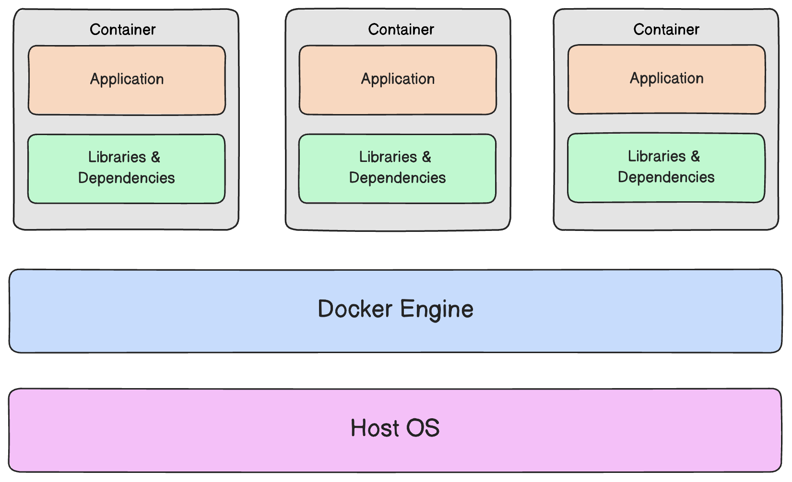

# Docker and Kubernetes

Understanding Docker means having a step back and analyze past development circumstances. Back 20 years ago, you would probably developed your solution on-premise, that is: configure you local machine with you stack development, and then starting to work. Weeks later you would probably ready to deploy your first solution on the server, therefore, you would sent the code to the system administrator, and few minutes later ... nothing works.

In fact, the problems was that: despite you set up correctly your local machine; there is still a difference between your computer and the hosting server. Moreover, there are differences between you device and anyone else.

Therefore, Docker was born initially to solve this problem, that is: provide a shared and portable configured environment, without use a Virtual Machine requiring more resources than Docker.

Docker's definition given by the [official documentation](https://docs.docker.com/manuals/), is enough clear to understand what Docker actually is:

> Docker is an open platform for developing, shipping, and running applications. Docker enables you to separate your applications from your infrastructure so you can deliver software quickly. With Docker, you can <ins>manage your infrastructure in the same ways you manage your applications</ins>.

Theoretically, Docker is based on the concept of **Container**, that is the smallest piece of execution's environment, easy sharable between different devices and easy to configure. Later, we will see how configure a container for our purposes, and how can be shared in a common repository known as Docker Hub.

## Containers vs Virtual Machines

Up to this moment, what is the difference between using Virtual Machines instead of a Docker Container? We can still use Virtual Machine to create a reproducible and dedicated environment, through develop our application. However, the answer to our doubs can be found in the technical details of Virtual Machines. Let's take a look on how Virtual Machines actually work using the following figure:

    

Instantiating a Virtual Machine, means installing a complete independent operating system (known as gust os), up to another operating system (known as host os). The only thing that will be abstracted is the hardware, and will be managed by a software known as hypervisor.

Based on this working model, there are some advantages in using Virtual Machine:

* Creating another operating system over an existing one, means that we have a completely separate environment, that is: any anomalous situation will no have any impact on our machine.

* We have separate and sharable environment, that can be configured for our needs.

On the other hand, emulating a separate operating system, using Virtual Machine, required a lot of resources. Moreover, a significance quantity of space in our hard drive will be required, most of the time, for replicated feature of the gust operating system that we won't need.

Now, differently from Virtual Machine, Docker's working architecture, can be described in the following figure:

    

As we can see, there is no more a guest operating system for each container. Moreover, each container is now managed by another module, known as Docker Engine.

Respect to the Hypervisor, the Docker Engine acts likes a bridge between the operating system and the container, abstracting the physical hardware of our machine. Moreover, also the core features of the operating system are shared, such that, only the essential features are used by the Containers, guaranteeing a minimal independent environment for the container.

In the end, we can summarize the advantages of using Containers with Docker in the following points:

* Containers are smaller and requires less resources than Virtual Machines.

* Just like Virtual Machines, Containers create a reproducible and sharable environment up to develop our application.

On the other hand, while Virtual Machines abstract just the physical hardware, Containers shares a part of the operating system resources with the host machine. That is, Virtual Machines are a more secure respect to Containers.
